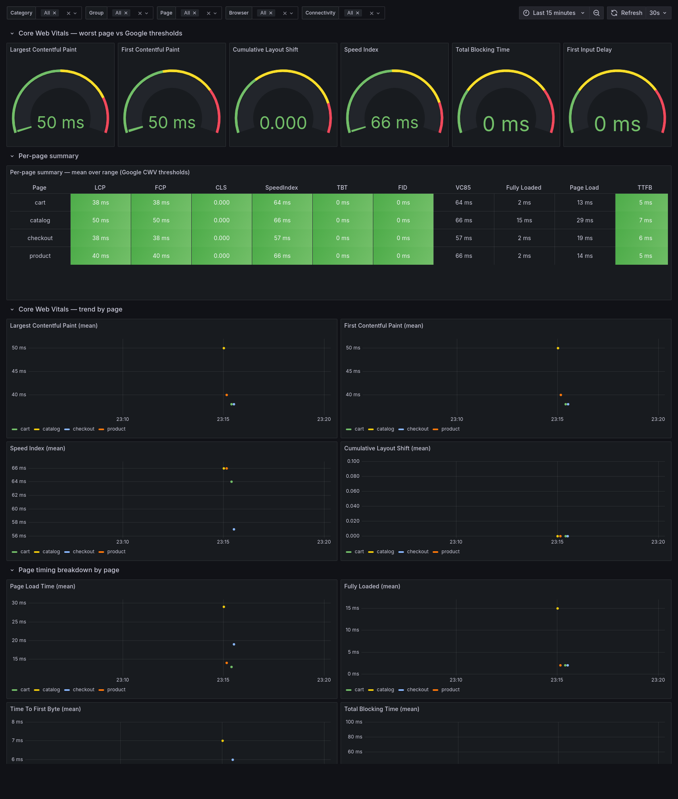

# ShopLite Observability — InfluxDB + Grafana (live dashboards)

Live performance dashboards for the **ShopLite** load-test series. `docker compose up`
brings up **InfluxDB 1.8 + Grafana** with the datasource and dashboards already
provisioned — then you point *any* of the load tools at it and watch the metrics fill
in **live** during a run.

This repo is the glue for the series: **run any tool → watch Grafana.** The same
ShopLite journey (Browse catalog → Add to cart → Checkout) is implemented across five
backend load tools plus a frontend one (sitespeed.io / Core Web Vitals); this gives them
a shared, real-time view — four dashboards in one **ShopLite** folder.

> 💡 **The script is the easy part.** The real value is knowing *what* to test, shaping
> the load model, reading the results, and turning them into a go/no-go call — judgment a
> demo can't capture.

> **Note.** This is a personal portfolio project — a from-scratch reconstruction
> built entirely on public, open-source tools against a fictional storefront. It is
> not affiliated with, and contains no material from, any employer or client.

## Contents
- `docker-compose.yml` — InfluxDB 1.8 + Grafana, datasource & dashboards auto-provisioned
- `dashboards/jmeter.json` — JMeter dashboard (NovatecConsulting #5496 lineage) with a
  per-transaction drill-down row; measurement `jmeter`, tags `application` / `transaction`
- `dashboards/k6.json` — k6 dashboard (Grafana #2587 lineage): VUs, RPS, errors, checks,
  per-metric percentiles; native k6 InfluxDB output
- `dashboards/custom.json` — generic OK/KO listener dashboard: field `response_time`,
  tags `status` (OK/KO) / `simulation` / `env`; for any tool whose listener writes this schema
- `dashboards/sitespeed-ui-perf.json` — sitespeed.io **Core Web Vitals** dashboard: gauges
  scored against Google thresholds + a per-page summary table; one measurement per metric
  (`largestContentfulPaint`, `cumulativeLayoutShift`, …), tags `page` / `browser` / `connectivity`
- `grafana/provisioning/` — datasources + dashboard provider (zero-click on startup)
- `influxdb/init.iql` — creates the `jmeter` / `k6` / `custom` / `sitespeed` databases on first boot
- `influxdb/influxdb.conf` — enables InfluxDB's Graphite listener (`:2003`) so sitespeed.io can
  push (it speaks Graphite, not the HTTP API), with templates that map keys → measurements/tags
- `mock/` — the same dependency-free mock backend used by the other repos
- `tools/feed-*.sh` — one-command scripts to drive a tool into this stack and fill a dashboard live

## Run in Docker (one command)
```bash
docker compose up
```
Then open **http://localhost:3000** (anonymous admin — no login) → folder **ShopLite**.

Point a tool at InfluxDB and run it; the dashboard updates live:

| Tool | How it pushes | Database | Dashboard |
|---|---|---|---|
| **JMeter** | Backend Listener (`InfluxdbBackendListenerClient`) → `http://localhost:8086`, measurement `jmeter` | `jmeter` | `jmeter.json` |
| **k6** | `k6 run --out influxdb=http://localhost:8086/k6 path/to/script.js` | `k6` | `k6.json` |
| **Any OK/KO listener** | write the OK/KO schema (see below) → `http://localhost:8086`, db `custom` | `custom` | `custom.json` |
| **sitespeed.io** | Graphite line protocol → `influxdb:2003` (no native InfluxDB output) | `sitespeed` | `sitespeed-ui-perf.json` |

> JMeter is plug-and-play with the JMeter dashboard: the
> [ShopLite-load-tests](https://github.com/scherednychenko/ShopLite-load-tests) JMX ships a
> Backend Listener — enable it and set the host to your InfluxDB.

## Feed the dashboards (one command each)

The load tools live in their own repos and don't run here — this stack is just the
InfluxDB + Grafana backend. The `tools/` scripts wire a tool to this stack on the same
Docker network and run it against the bundled mock, so the matching dashboard fills in
live. They assume the sibling repos are checked out next to this one (override with the
`*_REPO` env vars).

```bash
./tools/feed-jmeter.sh    # JMeter  → db jmeter   → "ShopLite — JMeter Performance"   (datasource: InfluxDB)
./tools/feed-k6.sh        # k6      → db k6       → "ShopLite — k6 Performance"        (datasource: InfluxDB-k6)
./tools/feed-custom.sh    # OK/KO demo data → db custom → "ShopLite — Custom Listener" (datasource: InfluxDB-custom)
./tools/feed-sitespeed.sh # sitespeed.io → db sitespeed → "ShopLite — UI Performance"  (datasource: InfluxDB-sitespeed)
```

Tunables, e.g.: `THREADS=25 DURATION=180 ./tools/feed-jmeter.sh`, `VUS=40 ./tools/feed-k6.sh`.
`feed-jmeter.sh` enables the JMeter Backend Listener in a **temp copy** of the JMX (the
published test plan is left untouched). `feed-custom.sh` generates representative OK/KO
data — no off-the-shelf tool writes that exact schema.

> **Picking the datasource matters.** Each dashboard reads one database, so select the
> matching datasource in the top-left dropdown (`InfluxDB` for JMeter, `InfluxDB-k6` for
> k6, `InfluxDB-custom` for the OK/KO board, `InfluxDB-sitespeed` for the Core Web Vitals
> board) — otherwise the panels show zeros.

## Stack lifecycle

```bash
docker compose up -d            # start in the background
docker compose up               # start in the foreground (Ctrl-C to stop)
docker compose ps               # what's running
docker compose logs -f grafana  # follow Grafana logs (or influxdb)
docker compose restart grafana  # reload after editing a dashboard JSON
docker compose stop             # stop containers, KEEP the data (volumes)
docker compose down             # remove containers + network, KEEP the data
docker compose down -v          # remove everything INCLUDING data (fresh start)
```

Metrics persist in named volumes across `stop`/`down`; use `down -v` for a clean slate.

## Dashboards

### JMeter — live, with per-transaction drill-down
`measurement = jmeter`, tags `application` / `transaction` / `statut` / `responseCode`.
Top section is the run-wide summary (throughput, error rate, response-time percentiles,
active threads); the **Individual Transaction** row drills into a single `$transaction`
selected from the template dropdown.


### k6 — native InfluxDB output
`k6 run --out influxdb` writes measurements `http_req_duration`, `http_reqs`, `vus`,
`checks`, `errors`. The dashboard shows virtual users, requests/s, errors/s, checks/s and
per-metric percentile breakdowns.


### Custom listener — OK/KO schema
A generic dashboard for any listener that writes per-sample points with field
`response_time` and tags `status` (`OK`/`KO`), `simulation`, `env`, `sampler_type`
(plus a `users` measurement for active VUs). Template variables pick the simulation,
environment, percentile and aggregation window. Point your listener at the `custom`
database and select **InfluxDB-custom** as the datasource.


### sitespeed.io — Core Web Vitals (frontend)
The one frontend board in the set. sitespeed.io drives a real browser over the storefront
and pushes via **Graphite** (`influxdb:2003`); the `influxdb.conf` templates turn each metric
into its own measurement (`largestContentfulPaint`, `cumulativeLayoutShift`, `SpeedIndex`, …).
The dashboard makes CWV the hero: gauges scored against Google thresholds plus a per-page
summary table with threshold-coloured cells. Select **InfluxDB-sitespeed** as the datasource.
Full tool + pipeline: [ShopLite-ui-perf](https://github.com/scherednychenko/ShopLite-ui-perf).



## Notes
- **InfluxDB 1.8 (InfluxQL)** on purpose: JMeter's Backend Listener and k6 both write to it
  natively, and every dashboard here is InfluxQL.
- Anonymous admin is enabled for a frictionless demo — **do not expose this compose stack
  publicly** as-is.
- Latencies you see depend on whatever tool/target you run; the bundled `mock/` backend is
  illustrative only — this demonstrates the tooling and reporting, not real performance.
- Dashboards are provisioned read-write (`allowUiUpdates: true`) so you can tweak panels;
  export back into `dashboards/` to persist.

## Roadmap
- [x] Live screenshots of all three dashboards (`docs/img/`)
- [ ] Animated GIF of a live run
- [ ] JMeter run-vs-run comparison dashboard (same `jmeter` measurement, two time windows)

## One scenario, six tools — plus a shared dashboard

The same ShopLite journey (browse → add-to-cart → checkout) is covered by six tools — five
backend load-testing tools plus a frontend Core Web Vitals one — each a one-command
Dockerized demo, with a shared live view here:

| Tool | Language / DSL | SLOs as | Report | Repo |
|---|---|---|---|---|
| Apache JMeter | XML + Groovy | Assertions | HTML dashboard | [ShopLite-load-tests](https://github.com/scherednychenko/ShopLite-load-tests) |
| Grafana k6 | JavaScript | Thresholds | HTML report | [ShopLite-load-tests-k6](https://github.com/scherednychenko/ShopLite-load-tests-k6) |
| Locust | Python | Code-level checks | Built-in HTML | [ShopLite-load-tests-locust](https://github.com/scherednychenko/ShopLite-load-tests-locust) |
| Gatling | Scala DSL | Assertions | HTML charts | [ShopLite-load-tests-gatling-scala](https://github.com/scherednychenko/ShopLite-load-tests-gatling-scala) |
| Gatling | Java DSL | Assertions | HTML charts | [ShopLite-load-tests-gatling-javaDSL](https://github.com/scherednychenko/ShopLite-load-tests-gatling-javaDSL) |
| sitespeed.io | JavaScript | Budgets | HTML + Grafana | [ShopLite-ui-perf](https://github.com/scherednychenko/ShopLite-ui-perf) |
| **Observability** | InfluxDB + Grafana | — | **Live dashboards** | **ShopLite-observability** (this repo) |

## License
MIT — see [LICENSE](LICENSE).
