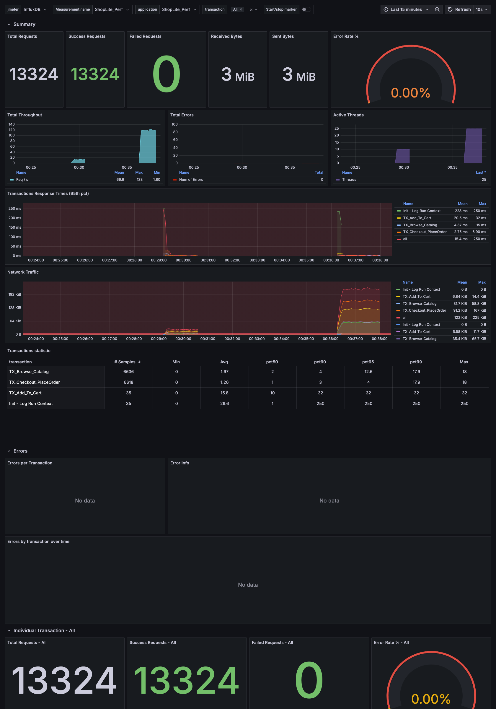
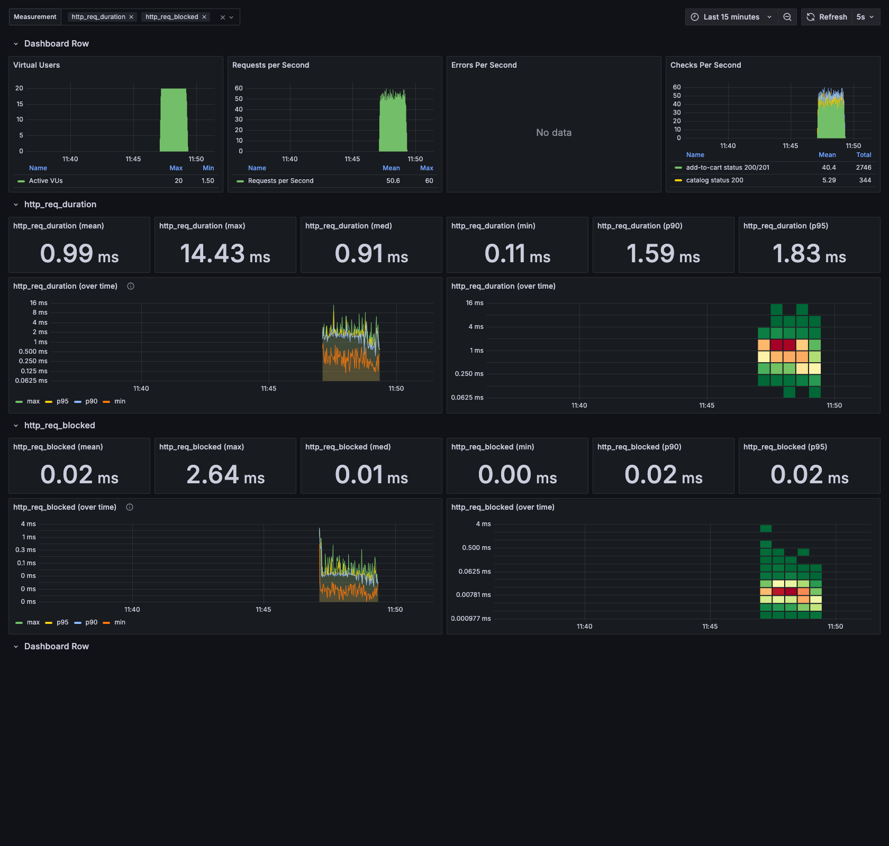
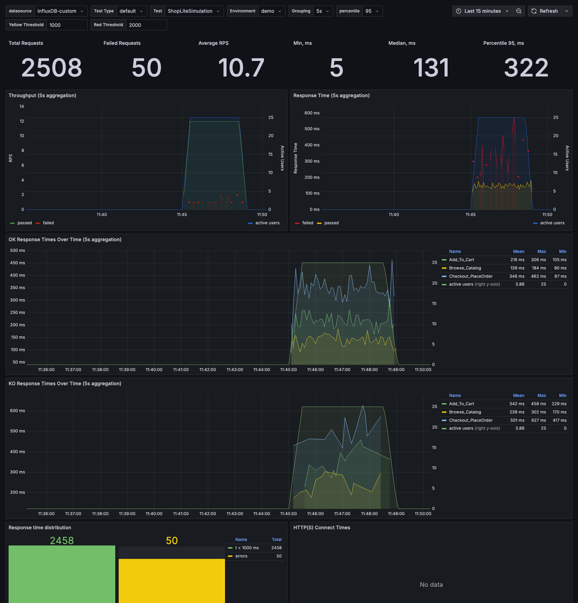

# ShopLite Observability — InfluxDB + Grafana (live dashboards)

Live performance dashboards for the **ShopLite** load-test series. `docker compose up`
brings up **InfluxDB 1.8 + Grafana** with the datasource and dashboards already
provisioned — then you point *any* of the load tools at it and watch the metrics fill
in **live** during a run.

This repo is the glue for the series: **run any tool → watch Grafana.** The same
ShopLite journey (Browse catalog → Add to cart → Checkout) is implemented across five
tools; this gives them a shared, real-time view.

> 💡 **The script is the easy part.** The real value is knowing *what* to test, shaping
> the load model, reading the results, and turning them into a go/no-go call — judgment a
> demo can't capture.

> **Note.** This is a personal portfolio project — a from-scratch reconstruction
> built entirely on public, open-source tools against a fictional storefront. It is
> not affiliated with, and contains no material from, any employer or client.

## Contents
- `docker-compose.yml` — InfluxDB 1.8 + Grafana, datasource & dashboards auto-provisioned
- `dashboards/jmeter.json` — JMeter dashboard (NovatecConsulting #5496 lineage) with a
  per-transaction drill-down row; measurement `jmeter`, tags `application` / `transaction`
- `dashboards/k6.json` — k6 dashboard (Grafana #2587 lineage): VUs, RPS, errors, checks,
  per-metric percentiles; native k6 InfluxDB output
- `dashboards/custom.json` — generic OK/KO listener dashboard: field `response_time`,
  tags `status` (OK/KO) / `simulation` / `env`; for any tool whose listener writes this schema
- `grafana/provisioning/` — datasources + dashboard provider (zero-click on startup)
- `influxdb/init.iql` — creates the `jmeter` / `k6` / `custom` databases on first boot
- `mock/` — the same dependency-free mock backend used by the other repos

## Run in Docker (one command)
```bash
docker compose up
```
Then open **http://localhost:3000** (anonymous admin — no login) → folder **ShopLite**.

Point a tool at InfluxDB and run it; the dashboard updates live:

| Tool | How it pushes | Database | Dashboard |
|---|---|---|---|
| **JMeter** | Backend Listener (`InfluxdbBackendListenerClient`) → `http://localhost:8086`, measurement `jmeter` | `jmeter` | `jmeter.json` |
| **k6** | `k6 run --out influxdb=http://localhost:8086/k6 script.js` | `k6` | `k6.json` |
| **Any OK/KO listener** | write the OK/KO schema (see below) → `http://localhost:8086`, db `custom` | `custom` | `custom.json` |

> JMeter is plug-and-play with the JMeter dashboard: the
> [ShopLite-load-tests](https://github.com/scherednychenko/ShopLite-load-tests) JMX ships a
> Backend Listener — enable it and set the host to your InfluxDB.

## Dashboards

### JMeter — live, with per-transaction drill-down
`measurement = jmeter`, tags `application` / `transaction` / `statut` / `responseCode`.
Top section is the run-wide summary (throughput, error rate, response-time percentiles,
active threads); the **Individual Transaction** row drills into a single `$transaction`
selected from the template dropdown.



### k6 — native InfluxDB output
`k6 run --out influxdb` writes measurements `http_req_duration`, `http_reqs`, `vus`,
`checks`, `errors`. The dashboard shows virtual users, requests/s, errors/s, checks/s and
per-metric percentile breakdowns.



### Custom listener — OK/KO schema
A generic dashboard for any listener that writes per-sample points with field
`response_time` and tags `status` (`OK`/`KO`), `simulation`, `env`, `sampler_type`
(plus a `users` measurement for active VUs). Template variables pick the simulation,
environment, percentile and aggregation window. Point your listener at the `custom`
database and select **InfluxDB-custom** as the datasource.



## Notes
- **InfluxDB 1.8 (InfluxQL)** on purpose: JMeter's Backend Listener and k6 both write to it
  natively, and every dashboard here is InfluxQL.
- Anonymous admin is enabled for a frictionless demo — **do not expose this compose stack
  publicly** as-is.
- Latencies you see depend on whatever tool/target you run; the bundled `mock/` backend is
  illustrative only — this demonstrates the tooling and reporting, not real performance.
- Dashboards are provisioned read-write (`allowUiUpdates: true`) so you can tweak panels;
  export back into `dashboards/` to persist.

## Roadmap
- [ ] Screenshot/GIF of a live run in the README (`docs/img/`)
- [ ] JMeter run-vs-run comparison dashboard (same `jmeter` measurement, two time windows)

## One scenario, five tools — plus a shared dashboard

The same ShopLite journey (browse → add-to-cart → checkout) is implemented across five
load-testing tools — each a one-command Dockerized demo — now with a shared live view here:

| Tool | Language / DSL | SLOs as | Report | Repo |
|---|---|---|---|---|
| Apache JMeter | XML + Groovy | Assertions | HTML dashboard | [ShopLite-load-tests](https://github.com/scherednychenko/ShopLite-load-tests) |
| Grafana k6 | JavaScript | Thresholds | HTML report | [ShopLite-load-tests-k6](https://github.com/scherednychenko/ShopLite-load-tests-k6) |
| Locust | Python | Code-level checks | Built-in HTML | [ShopLite-load-tests-locust](https://github.com/scherednychenko/ShopLite-load-tests-locust) |
| Gatling | Scala DSL | Assertions | HTML charts | [ShopLite-load-tests-gatling-scala](https://github.com/scherednychenko/ShopLite-load-tests-gatling-scala) |
| Gatling | Java DSL | Assertions | HTML charts | [ShopLite-load-tests-gatling-javaDSL](https://github.com/scherednychenko/ShopLite-load-tests-gatling-javaDSL) |
| **Observability** | InfluxDB + Grafana | — | **Live dashboards** | **ShopLite-observability** (this repo) |

## License
MIT — see [LICENSE](LICENSE).
