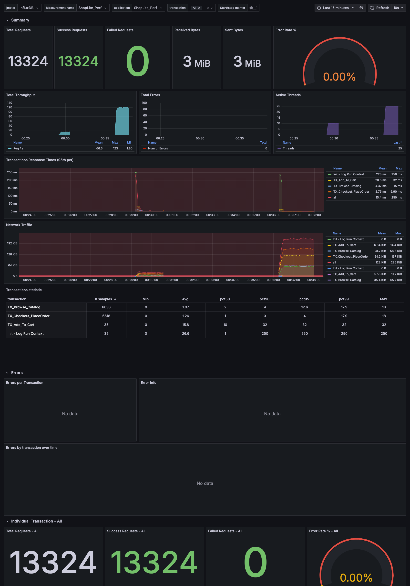
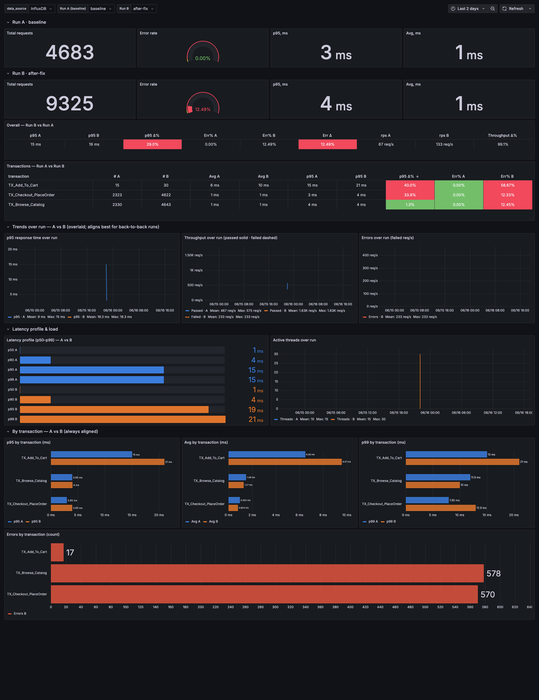
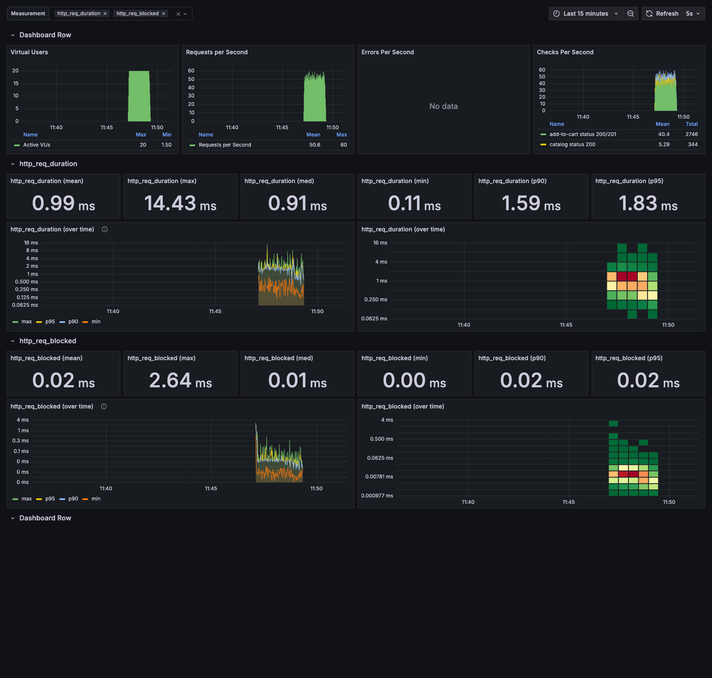
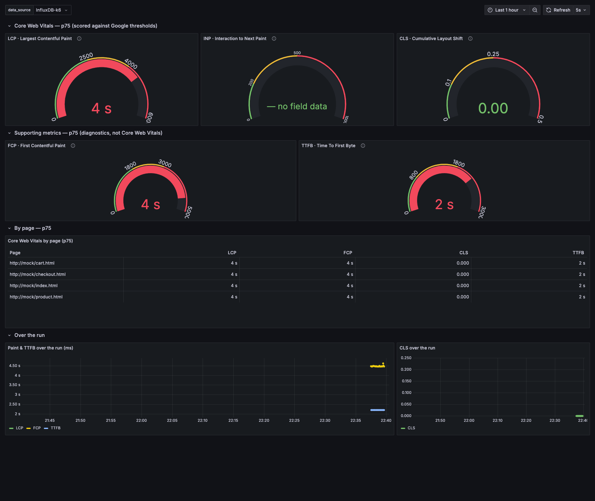
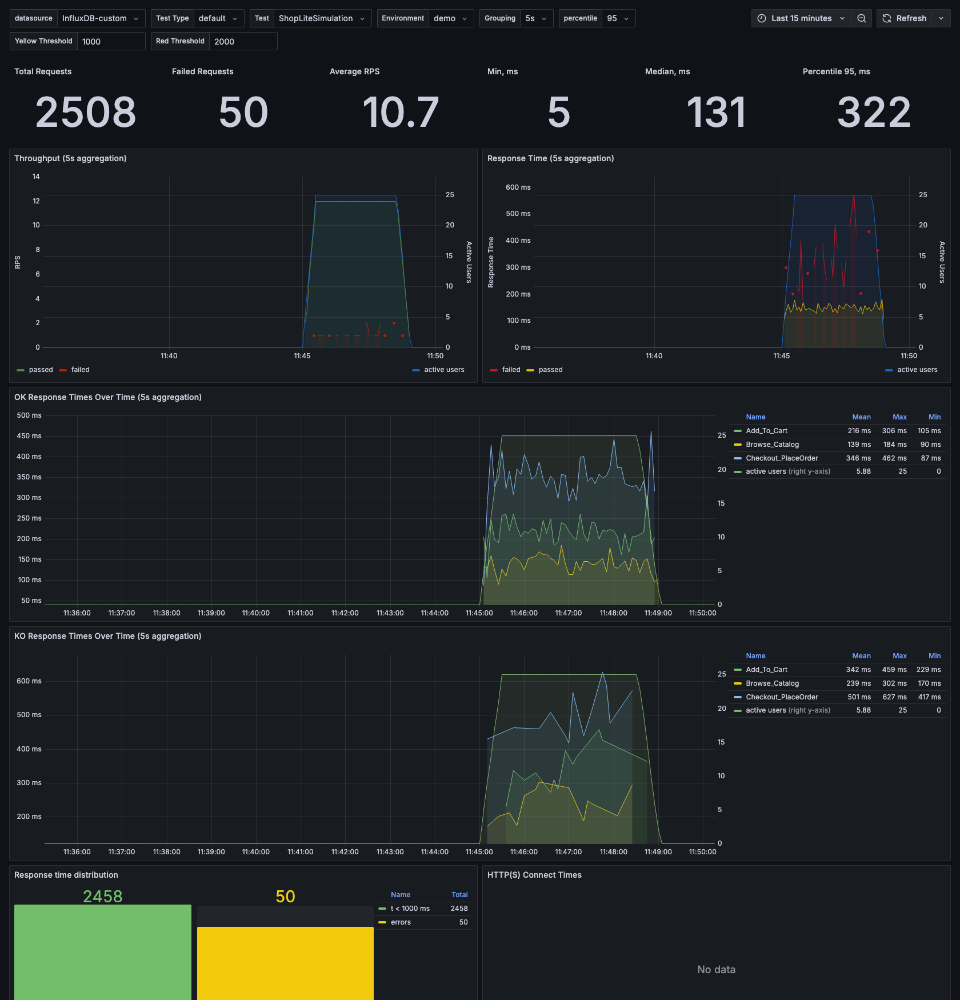
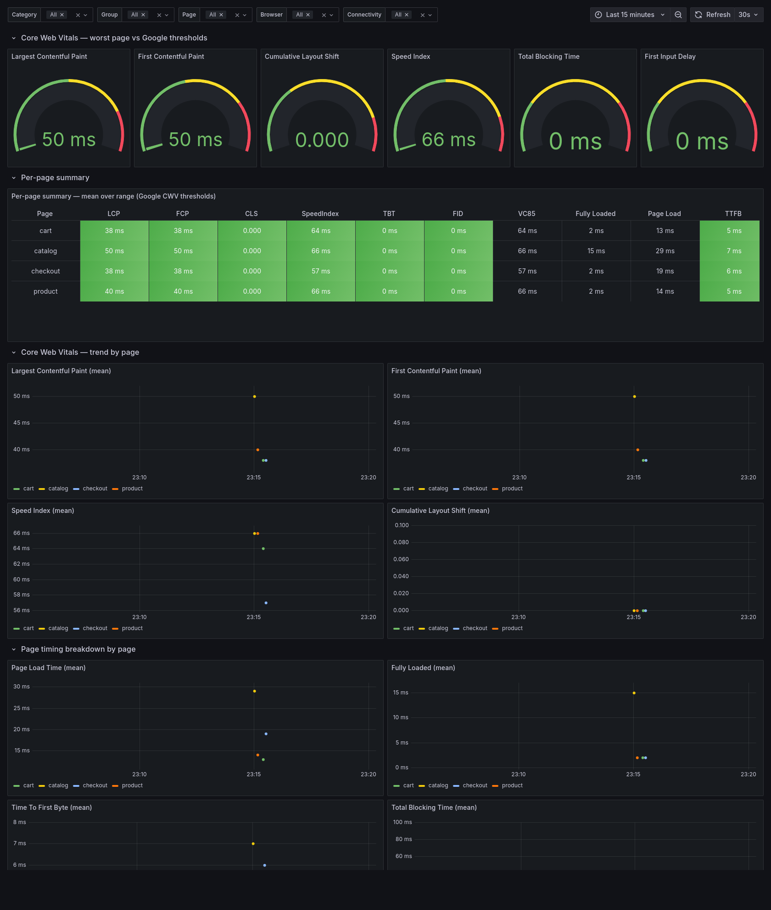
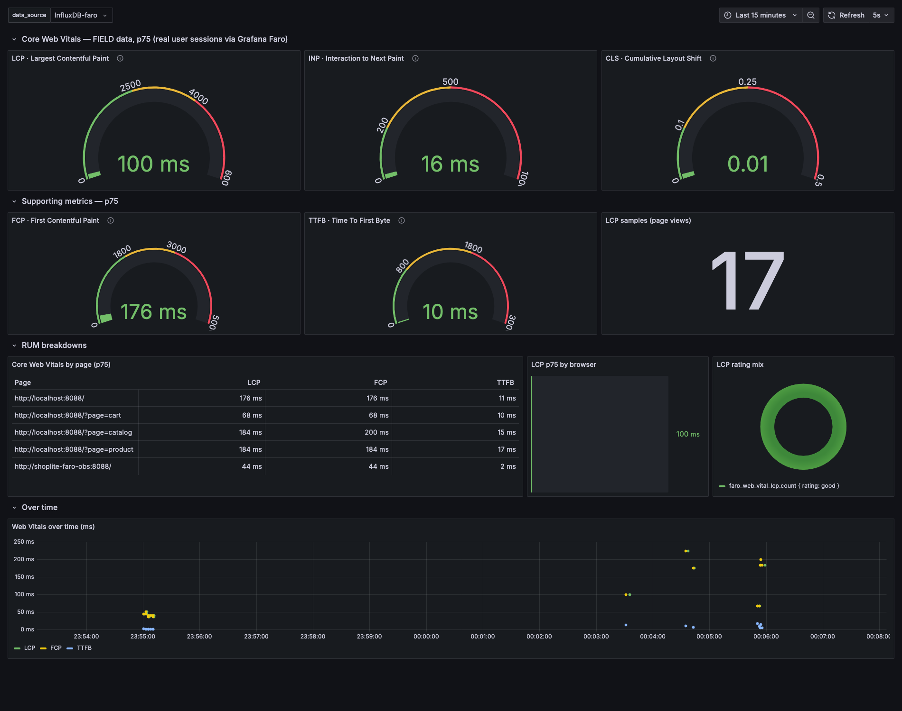

# ShopLite Observability — InfluxDB + Grafana (live dashboards)

Live performance dashboards for the **ShopLite** load-test series. `docker compose up`
brings up **InfluxDB 1.8 + Grafana** with the datasource and dashboards already
provisioned — then you point *any* of the load tools at it and watch the metrics fill
in **live** during a run.

This repo is the glue for the series: **run any tool → watch Grafana.** The same
ShopLite journey (Browse catalog → Add to cart → Checkout) is implemented across five
backend load tools plus a frontend one (sitespeed.io / Core Web Vitals); this gives them
a shared, real-time view — four dashboards in one **ShopLite** folder.

> 💡 **The script is the easy part.** The real value is knowing *what* to test, shaping
> the load model, reading the results, and turning them into a go/no-go call — judgment a
> demo can't capture.

> **Note.** This is a personal portfolio project — a from-scratch reconstruction
> built entirely on public, open-source tools against a fictional storefront. It is
> not affiliated with, and contains no material from, any employer or client.

## Contents
- `docker-compose.yml` — InfluxDB 1.8 + Grafana, datasource & dashboards auto-provisioned
- `dashboards/jmeter.json` — JMeter dashboard (NovatecConsulting #5496 lineage) with a
  per-transaction drill-down row; measurement `jmeter`, tags `application` / `transaction`
- `dashboards/jmeter-compare.json` — **run-vs-run comparison**: pick **Run A** and **Run B**
  from dropdowns (runs are told apart by the `application` tag, set per run via `RUN_LABEL`)
  and read the Overall Δ summary + per-transaction Δ table + overlaid trend charts
- `dashboards/k6.json` — k6 dashboard (Grafana #2587 lineage): VUs, RPS, errors, checks,
  per-metric percentiles; native k6 InfluxDB output
- `dashboards/k6-browser-cwv.json` — **k6 browser Core Web Vitals**: LCP / INP / CLS / FCP /
  TTFB gauges scored at p75 against Google thresholds, a per-page table, and trend charts;
  fed by the `k6/browser` module (real Chromium), measurements `browser_web_vital_*`
- `dashboards/custom.json` — generic OK/KO listener dashboard: field `response_time`,
  tags `status` (OK/KO) / `simulation` / `env`; for any tool whose listener writes this schema
- `dashboards/sitespeed-ui-perf.json` — sitespeed.io **Core Web Vitals** dashboard: gauges
  scored against Google thresholds + a per-page summary table; one measurement per metric
  (`largestContentfulPaint`, `cumulativeLayoutShift`, …), tags `page` / `browser` / `connectivity`
- `dashboards/faro-rum-cwv.json` — **Frontend RUM (Grafana Faro)**: the *field* Core Web Vitals
  board (real user sessions, INP included) — LCP/INP/CLS/FCP/TTFB p75 + per-page / per-browser /
  rating breakdowns; fed by `tools/faro_collector.py`, measurements `faro_web_vital_*`
- `grafana/provisioning/` — datasources + dashboard provider (zero-click on startup)
- `influxdb/init.iql` — creates the `jmeter` / `k6` / `custom` / `sitespeed` / `faro` databases on first boot
- `influxdb/influxdb.conf` — enables InfluxDB's Graphite listener (`:2003`) so sitespeed.io can
  push (it speaks Graphite, not the HTTP API), with templates that map keys → measurements/tags
- `mock/` — the same dependency-free mock backend used by the other repos
- `tools/feed-*.sh` — one-command scripts to drive a tool into this stack and fill a dashboard live
- `tools/locust_influx_listener.py` — extra locustfile that gives Locust an InfluxDB (OK/KO) output, used by `feed-locust.sh`
- `tools/gatling_log_to_influx.py` — parses a Gatling `simulation.log` into the OK/KO schema, used by `feed-gatling-{scala,java}.sh`

## Run in Docker (one command)
```bash
docker compose up
```
Then open **http://localhost:3000** (anonymous admin — no login) → folder **ShopLite**.

Point a tool at InfluxDB and run it; the dashboard updates live:

| Tool | How it pushes | Database | Dashboard |
|---|---|---|---|
| **JMeter** | Backend Listener (`InfluxdbBackendListenerClient`) → `http://localhost:8086`, measurement `jmeter` | `jmeter` | `jmeter.json` |
| **k6** | `k6 run --out influxdb=http://localhost:8086/k6 path/to/script.js` | `k6` | `k6.json` |
| **Any OK/KO listener** | write the OK/KO schema (see below) → `http://localhost:8086`, db `custom` | `custom` | `custom.json` |
| **sitespeed.io** | Graphite line protocol → `influxdb:2003` (no native InfluxDB output) | `sitespeed` | `sitespeed-ui-perf.json` |

> JMeter is plug-and-play with the JMeter dashboard: the
> [ShopLite-load-tests](https://github.com/scherednychenko/ShopLite-load-tests) JMX ships a
> Backend Listener — enable it and set the host to your InfluxDB.

## Feed the dashboards (one command each)

The load tools live in their own repos and don't run here — this stack is just the
InfluxDB + Grafana backend. The `tools/` scripts wire a tool to this stack on the same
Docker network and run it against the bundled mock, so the matching dashboard fills in
live. They assume the sibling repos are checked out next to this one (override with the
`*_REPO` env vars).

```bash
./tools/feed-jmeter.sh    # JMeter  → db jmeter   → "ShopLite — JMeter Performance"   (datasource: InfluxDB)
./tools/feed-k6.sh        # k6      → db k6       → "ShopLite — k6 Performance"        (datasource: InfluxDB-k6)
./tools/feed-k6-browser.sh # k6 browser → db k6  → "ShopLite — k6 Browser (Core Web Vitals)" (datasource: InfluxDB-k6)
./tools/feed-custom.sh        # OK/KO demo data → db custom (test ShopLiteSimulation) → "ShopLite — Custom Listener"
./tools/feed-locust.sh        # Locust  → db custom (test ShopLiteLocust)       → "ShopLite — Custom Listener"
./tools/feed-gatling-scala.sh # Gatling (Scala) → db custom (test ShopLiteGatlingScala) → "ShopLite — Custom Listener"
./tools/feed-gatling-java.sh  # Gatling (Java)  → db custom (test ShopLiteGatlingJava)  → "ShopLite — Custom Listener"
./tools/feed-sitespeed.sh     # sitespeed.io → db sitespeed → "ShopLite — UI Performance" (datasource: InfluxDB-sitespeed)
./tools/feed-faro.sh          # Grafana Faro RUM (server) → db faro → "ShopLite — Frontend RUM (Faro)" (datasource: InfluxDB-faro)
```
The OK/KO board (`InfluxDB-custom`) is the shared home for the "generic OK/KO" tools —
Locust and both Gatling DSLs all land in db `custom`, told apart by the `Test` dropdown
(`ShopLiteLocust` / `ShopLiteGatlingScala` / `ShopLiteGatlingJava`, plus the synthetic
`ShopLiteSimulation`).

Tunables, e.g.: `THREADS=25 DURATION=180 ./tools/feed-jmeter.sh`, `VUS=40 ./tools/feed-k6.sh`.

To compare two JMeter runs, **label each run** with `RUN_LABEL` (written as the `application`
tag) and then pick them on the comparison board:
```bash
RUN_LABEL=baseline  ./tools/feed-jmeter.sh                         # run 1
RUN_LABEL=after-fix THREADS=30 ./tools/feed-jmeter.sh              # run 2 (e.g. heavier load)
# → open "ShopLite — JMeter Run Comparison", set Run A = baseline, Run B = after-fix
```
Without `RUN_LABEL` the run is tagged `ShopLite_Perf` (the default the single-run board reads).
`feed-jmeter.sh` enables the JMeter Backend Listener in a **temp copy** of the JMX (the
published test plan is left untouched). `feed-custom.sh` generates representative OK/KO
**demo** data — no off-the-shelf tool writes that exact schema. The **real** producers for
that board don't need their repos modified:
- `feed-locust.sh` loads a small extra locustfile (`tools/locust_influx_listener.py`) as a
  second `-f` that writes the OK/KO schema live during the run.
- `feed-gatling-scala.sh` / `feed-gatling-java.sh` run Gatling, then parse its
  `simulation.log` (`tools/gatling_log_to_influx.py`) into the same schema (Gatling has no
  per-sample InfluxDB output).

Tunables for these: `USERS=40 RUN_TIME=180s ./tools/feed-locust.sh`,
`VUS=40 CART_SIZE=12 ./tools/feed-gatling-scala.sh`.

### Paint the boards red (failure demo)
To show every board in an *unhealthy* state (for screenshots), `./tools/demo-failures.sh`
drives all six tools into failure:

```bash
./tools/demo-failures.sh                 # ~12-20 min: all six tools, then leaves the stack up
MOCK_FAIL_RATE=0.3 ./tools/demo-failures.sh
```

- **API tools** (JMeter, k6, Locust, Gatling x2) hit `tools/chaos_mock.py`, which fails
  `MOCK_FAIL_RATE` (default 0.2) of requests with HTTP 500 -> real errors / KO -> red
  error-rate gauges and KO panels. Each feeder also honours `MOCK_FAIL_RATE` on its own,
  e.g. `MOCK_FAIL_RATE=0.2 ./tools/feed-k6.sh`.
- **sitespeed** runs with `SLOW=1`, which serves the storefront through
  `tools/slow_storefront.py` (a per-response delay) so Core Web Vitals blow past Google's
  thresholds -> amber/red gauges and table cells. (sitespeed's own connectivity throttling
  can't run on Docker Desktop - no `ifb` kernel module - so we slow the server instead.)
  Tune with `SLOW=1 DELAY_MS=2500 ./tools/feed-sitespeed.sh`.

A captured failure run — board screenshots plus a short written analysis (what broke, how
it reads, what to fix) — lives in **[`reports/`](reports/SAMPLE_PERFORMANCE_REPORT.md)**.

> **Picking the datasource matters.** Each dashboard reads one database, so select the
> matching datasource in the top-left dropdown (`InfluxDB` for JMeter, `InfluxDB-k6` for
> k6, `InfluxDB-custom` for the OK/KO board, `InfluxDB-sitespeed` for the sitespeed Core Web
> Vitals board, `InfluxDB-faro` for the Frontend RUM board) — otherwise the panels show zeros.

## Stack lifecycle

```bash
docker compose up -d            # start in the background
docker compose up               # start in the foreground (Ctrl-C to stop)
docker compose ps               # what's running
docker compose logs -f grafana  # follow Grafana logs (or influxdb)
docker compose restart grafana  # reload after editing a dashboard JSON
docker compose stop             # stop containers, KEEP the data (volumes)
docker compose down             # remove containers + network, KEEP the data
docker compose down -v          # remove everything INCLUDING data (fresh start)
```

Metrics persist in named volumes across `stop`/`down`; use `down -v` for a clean slate.

## Dashboards

### JMeter — live, with per-transaction drill-down
`measurement = jmeter`, tags `application` / `transaction` / `statut` / `responseCode`.
Top section is the run-wide summary (throughput, error rate, response-time percentiles,
active threads); the **Individual Transaction** row drills into a single `$transaction`
selected from the template dropdown.



### JMeter — run-vs-run comparison
Compares **two runs side by side** without fiddling with time windows. Each run is
identified by its `application` tag (set with `RUN_LABEL` when feeding), so you just pick
**Run A** (the baseline) and **Run B** from the two dropdowns — no timestamp math, which was
the pain point of the old time-window comparison boards.

The board has three blocks: a **stat header** per run (total requests, error-rate gauge,
p95, avg), an **Overall — Run B vs Run A** one-liner with the headline deltas, a
**per-transaction Δ table** (sorted by p95 Δ%, threshold-coloured), and **overlaid trend
charts** (p95 / throughput / errors over the run, plus active threads & latency profile).

**How the deltas are computed** (so the numbers reconcile with the single-run board):

| Metric | Formula | Type |
|---|---|---|
| **p95 Δ%** | `(p95 B − p95 A) / p95 A × 100` | relative % change |
| **Throughput Δ%** | `(rps B − rps A) / rps A × 100` | relative % change |
| **Err Δ** | `Err% B − Err% A` | absolute difference (percentage points) |

- **Error rate** uses `sum(countError) / sum(count)` on the `transaction='all'` rollup — the
  same formula as the single-run error gauge, so a run's Err% matches on both boards.
- **p95 / avg / throughput** are computed over the real journey transactions only
  (`transaction =~ /^TX_/`), so setup steps like `Init - Log Run Context` don't skew latency.
- p95 and throughput are shown as **relative change** (normalised to A); error rate is already
  a percentage, so its delta is an **absolute** percentage-point difference.
- Δ values are calculated at full precision; the A/B cells are rounded to whole units, so a
  rounded `15 → 19 ms` can still read as `29%` (it's `19.35 / 15`, not `19 / 15`).



### k6 — native InfluxDB output
`k6 run --out influxdb` writes measurements `http_req_duration`, `http_reqs`, `vus`,
`checks`, `errors`. The dashboard shows virtual users, requests/s, errors/s, checks/s and
per-metric percentile breakdowns.



### k6 browser — Core Web Vitals (lab/synthetic)
The protocol-level k6 board above measures the API; this one measures the **rendered
frontend**. `./tools/feed-k6-browser.sh` runs the ShopLite journey through a real Chromium via
the [`k6/browser`](https://grafana.com/docs/k6/latest/using-k6-browser/) module, which
auto-collects Web Vitals and streams them to InfluxDB as `browser_web_vital_*`
(`lcp`/`inp`/`cls`/`fcp`/`ttfb`, field `value`, tags `name`=page-URL and `rating`). The board
scores **LCP / INP / CLS** (the three Core Web Vitals) plus **FCP / TTFB** at the 75th
percentile against Google's thresholds, with a per-page table and per-run trends.

```bash
./tools/feed-k6-browser.sh                       # fast storefront → green
SLOW=1 DELAY_MS=2200 ./tools/feed-k6-browser.sh  # slow storefront → amber/red (shown below)
```



Two caveats worth understanding (they're the whole point of practising this):
- **INP shows no data here, by design.** INP needs *real* user interactions to produce
  Event-Timing entries; synthetic clicks usually don't. INP is really a **field/RUM** metric —
  in production it comes from a browser SDK like **Grafana Faro** or Google **CrUX**, not a lab tool.
- This is **lab/synthetic** data on a mock storefront — repeatable and good for catching
  regressions in CI, but it's not what real users experience. Lab (k6 browser, sitespeed.io,
  Lighthouse) and field (Faro/CrUX RUM) answer different questions; a mature setup uses both.

> **Run it in k6 Cloud (Grafana Cloud k6).** The same script runs unchanged in the cloud,
> where Web Vitals get a built-in results view — no dashboard to build. On a **free** Grafana
> Cloud account: `k6 cloud login --token <STACK_TOKEN>`, then point it at a **publicly
> reachable** URL (the cloud can't see your local mock) and run
> `BASE_URL=https://your-site.example.com k6 cloud run tools/k6-browser-cwv.js`. Cloud runs the
> browser remotely, so you don't even need Chromium locally.

### Custom listener — OK/KO schema
A generic dashboard for any listener that writes per-sample points with field
`response_time` and tags `status` (`OK`/`KO`), `simulation`, `env`, `sampler_type`
(plus a `users` measurement for active VUs). Template variables pick the simulation,
environment, percentile and aggregation window. Point your listener at the `custom`
database and select **InfluxDB-custom** as the datasource.

**Locust and both Gatling DSLs feed this board** (none has a per-sample InfluxDB output):
- `./tools/feed-locust.sh` loads `tools/locust_influx_listener.py` as an extra locustfile
  that emits this schema live, under test `ShopLiteLocust`.
- `./tools/feed-gatling-scala.sh` and `./tools/feed-gatling-java.sh` run Gatling, then parse
  its `simulation.log` with `tools/gatling_log_to_influx.py`, under tests `ShopLiteGatlingScala`
  / `ShopLiteGatlingJava`.

So one generic board serves the synthetic demo and three real tools — pick the run in the
`Test` dropdown. The published tool repos are never modified.



### sitespeed.io — Core Web Vitals (frontend)
A frontend (lab) board. sitespeed.io drives a real browser over the storefront
and pushes via **Graphite** (`influxdb:2003`); the `influxdb.conf` templates turn each metric
into its own measurement (`largestContentfulPaint`, `cumulativeLayoutShift`, `SpeedIndex`, …).
The dashboard makes CWV the hero: gauges scored against Google thresholds plus a per-page
summary table with threshold-coloured cells. Select **InfluxDB-sitespeed** as the datasource.
Full tool + pipeline: [ShopLite-ui-perf](https://github.com/scherednychenko/ShopLite-ui-perf).



### Frontend RUM — Grafana Faro (field Core Web Vitals)
The three boards above (k6 browser, sitespeed.io) are **lab/synthetic** — repeatable runs in a
controlled browser, great for CI. This one is the **field** counterpart: Core Web Vitals from
**real user sessions**, the way a production app actually reports them. `./tools/feed-faro.sh`
serves a ShopLite page instrumented with the real **[Grafana Faro Web SDK](https://github.com/grafana/faro-web-sdk)**
plus a tiny collector (`tools/faro_collector.py`) that receives the SDK's beacons and writes the
Web Vitals to InfluxDB (`faro_web_vital_*`, tags `page`/`browser`/`session`/`rating`). Open the
page, click around, and the board fills in — **per page, per browser, with a good/needs-improvement/poor
mix**, just like RUM in production.

```bash
./tools/feed-faro.sh          # starts the page + collector on :8088 (a server; ./tools/feed-faro.sh stop to end)
# → open http://localhost:8088/ in a real browser and click 'Add to cart' / navigate
```



**Why this matters — lab vs field, made concrete:**
- **INP only shows up here.** Interaction-to-Next-Paint needs *real* clicks (Event-Timing entries);
  synthetic drivers (k6 browser, headless Chrome) don't produce them, so the lab boards leave INP
  empty. RUM captures it because a human is actually interacting. The same is true for real CLS.
- **In production the collector is bigger.** Here it's a 100-line Python receiver → InfluxDB; a real
  setup uses **Grafana Alloy** (`faro.receiver`) → Loki/Tempo/Prometheus, or **Grafana Cloud Frontend
  Observability**. The browser-SDK-→-collector-→-dashboard *shape* is identical — that's the point.
- So a mature frontend-perf practice runs **both**: lab (this repo's k6 browser / sitespeed) to gate
  regressions in CI, and field/RUM (Faro/CrUX) to see what real users experience.

## Notes
- **InfluxDB 1.8 (InfluxQL)** on purpose: JMeter's Backend Listener and k6 both write to it
  natively, and every dashboard here is InfluxQL.
- Anonymous admin is enabled for a frictionless demo — **do not expose this compose stack
  publicly** as-is.
- Latencies you see depend on whatever tool/target you run; the bundled `mock/` backend is
  illustrative only — this demonstrates the tooling and reporting, not real performance.
- Dashboards are provisioned read-write (`allowUiUpdates: true`) so you can tweak panels;
  export back into `dashboards/` to persist.

## Roadmap
- [x] Live screenshots of all three dashboards (`docs/img/`)
- [ ] Animated GIF of a live run
- [x] JMeter run-vs-run comparison dashboard (runs picked by `application` tag, no time-window math)
- [x] k6 browser Core Web Vitals dashboard (lab Web Vitals via the `k6/browser` module)
- [x] Frontend RUM dashboard (field Core Web Vitals via the Grafana Faro Web SDK)

## One scenario, six tools — plus a shared dashboard

The same ShopLite journey (browse → add-to-cart → checkout) is covered by six tools — five
backend load-testing tools plus a frontend Core Web Vitals one — each a one-command
Dockerized demo, with a shared live view here:

| Tool | Language / DSL | SLOs as | Report | Repo |
|---|---|---|---|---|
| Apache JMeter | XML + Groovy | Assertions | HTML dashboard | [ShopLite-load-tests](https://github.com/scherednychenko/ShopLite-load-tests) |
| Grafana k6 | JavaScript | Thresholds | HTML report | [ShopLite-load-tests-k6](https://github.com/scherednychenko/ShopLite-load-tests-k6) |
| Locust | Python | Code-level checks | Built-in HTML | [ShopLite-load-tests-locust](https://github.com/scherednychenko/ShopLite-load-tests-locust) |
| Gatling | Scala DSL | Assertions | HTML charts | [ShopLite-load-tests-gatling-scala](https://github.com/scherednychenko/ShopLite-load-tests-gatling-scala) |
| Gatling | Java DSL | Assertions | HTML charts | [ShopLite-load-tests-gatling-javaDSL](https://github.com/scherednychenko/ShopLite-load-tests-gatling-javaDSL) |
| sitespeed.io | JavaScript | Budgets | HTML + Grafana | [ShopLite-ui-perf](https://github.com/scherednychenko/ShopLite-ui-perf) |
| **Observability** | InfluxDB + Grafana | — | **Live dashboards** | **ShopLite-observability** (this repo) |

## License
MIT — see [LICENSE](LICENSE).
