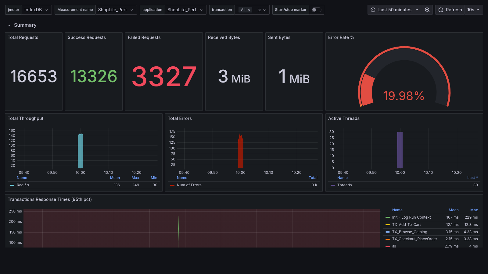
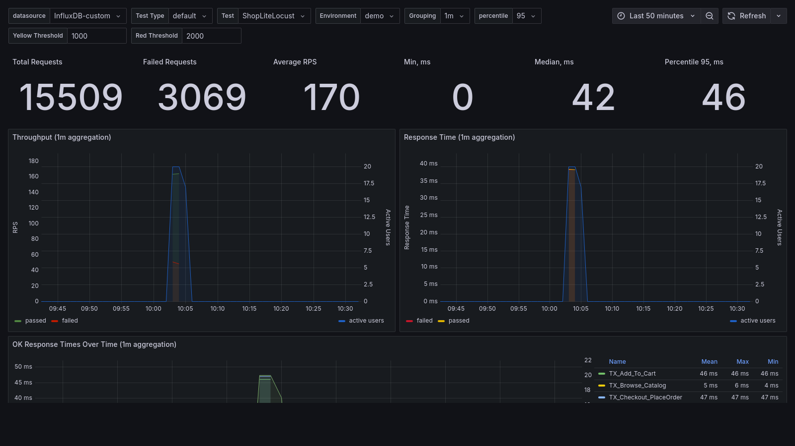
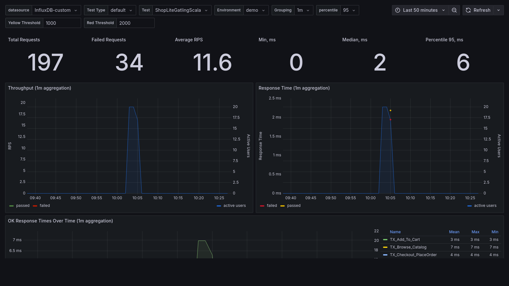
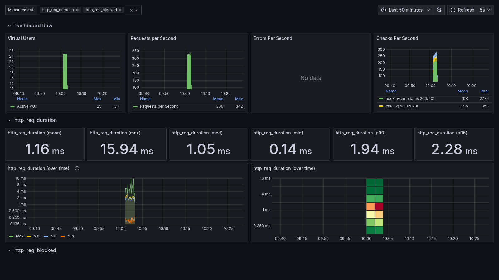
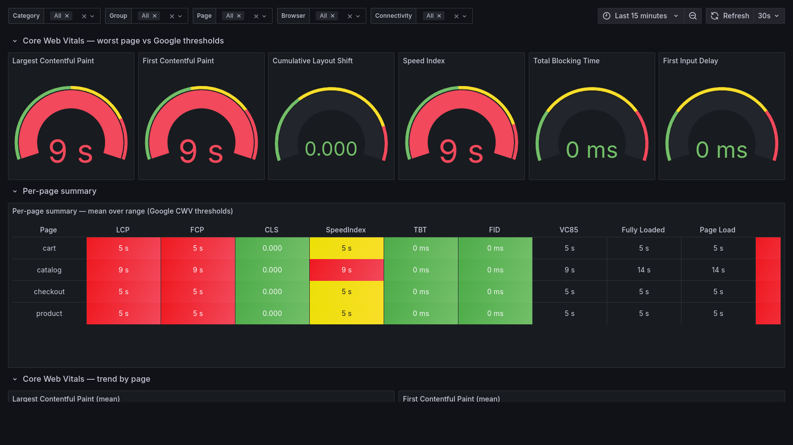

# ShopLite — Sample Performance Report (failure run)

> **What this is.** A short, illustrative performance report written off a single
> *deliberately broken* run of the ShopLite suite, to show how results are read and
> communicated — not a deep bottleneck teardown. Failures are **synthetic**: a chaos
> mock returns HTTP 500 for ~20% of API requests, and the storefront is throttled for
> the browser test (see [`tools/demo-failures.sh`](../tools/demo-failures.sh)). All data
> is generated against a fictional app; this is not a real incident.

**Run:** `./tools/demo-failures.sh` · ~20 VUs/threads per tool · InfluxDB + Grafana (this repo).

## SLOs and results

| Area | Tool | SLO | Observed | Verdict |
|---|---|---|---:|:--:|
| Availability | JMeter | error rate < 1% | **19.98%** (3 327 / 16 653) | 🔴 |
| Availability | k6 | `http_req_failed` < 1% | ~20% (threshold breached, run exited non-zero) | 🔴 |
| Availability | Locust | error rate < 1% | **~19.8%** (3 069 / 15 509) | 🔴 |
| Availability | Gatling (Scala/Java) | KO = 0 | **~17%** KO (34 / 197) | 🔴 |
| Frontend | sitespeed.io | LCP ≤ 2.5s · FCP ≤ 1.8s · SI ≤ 3.4s | **~9s / ~9s / ~9s** | 🔴 |

## Key findings

1. **The fault is server-side, not endpoint- or client-specific.** The ~20% 5xx rate is
   *uniform* across every transaction (browse / add-to-cart / checkout) **and** across four
   independent tools. A single misbehaving endpoint or one tool's config would not fail
   evenly everywhere — this points at a shared backend dependency / config, not the workload.
2. **It's an availability problem, not a capacity one.** Response times stayed low
   (medians ~2–45 ms) *while* a fifth of requests failed — the server is **rejecting fast
   (500), not slowing down**. Throughput and latency look healthy; only the success rate
   collapsed. Capacity tuning would be the wrong fix here.
3. **Frontend regression is latency-driven, not layout- or weight-driven.** LCP/FCP/Speed
   Index all blew past Google thresholds (~9 s) **but CLS stayed 0** and TBT ~0. Nothing
   shifted or blocked the main thread — the page just arrived late. That isolates the cause
   to TTFB / network / server response time, not page weight or rendering.
4. **Instrumentation gap on the k6 board.** k6 breached its `http_req_failed` threshold
   (the run exited non-zero), yet the board's *Errors/s* panel reads **No data** — it's
   wired to a custom `errors` counter the scenario never emits. Failures are real but
   invisible on that board. (Fix below.)

## Recommendations

- **Investigate the 5xx at the source** (server logs / APM): a flat ~20% across all routes
  usually means a shared dependency, throttle, or a bad deploy/flag — not application logic.
- **Add an availability SLO + alert** (e.g. error rate > 2% for 2 min) so this pages a human
  instead of being read off a chart after the fact.
- **Frontend:** because CWV degraded through latency, prioritise TTFB (CDN / caching / server
  response), and add an **LCP ≤ 2.5s budget as a CI gate** to catch regressions pre-prod.
- **Close the k6 dashboard gap:** point *Errors/s* at `http_req_failed`, or add a
  `Rate('errors')` metric in the k6 scenario, so failed runs are visible on the board.

## Evidence (per board)

### JMeter — 19.98% error rate

Error-rate gauge red at **19.98%**; *Total Errors* tracks throughput (fast 5xx, not slowdown);
per-transaction response times stay in single-digit ms.

### Locust — ~20% failed (OK/KO board)

**3 069 / 15 509** requests failed; the *failed* series rides alongside *passed* across the
whole window. (Locust feeds the shared OK/KO board via the InfluxDB listener.)

### Gatling — KO transactions (OK/KO board)

**34 / 197** KO; the `status.is(2xx)` checks fail on the injected 500s and surface as KO
(parsed from `simulation.log`). Java DSL shows the same shape.

### k6 — failures real, panel blind

VUs / RPS / checks populate and the latency heatmap is healthy, but *Errors/s* shows **No
data** — finding #4 above. The threshold breach is what actually fails the run.

### sitespeed.io — Core Web Vitals over threshold

LCP / FCP / Speed Index gauges red (~9 s) and every page red in the summary table, while
**CLS = 0** and **TBT = 0** stay green — a clean signal that this is latency, not layout/CPU.
